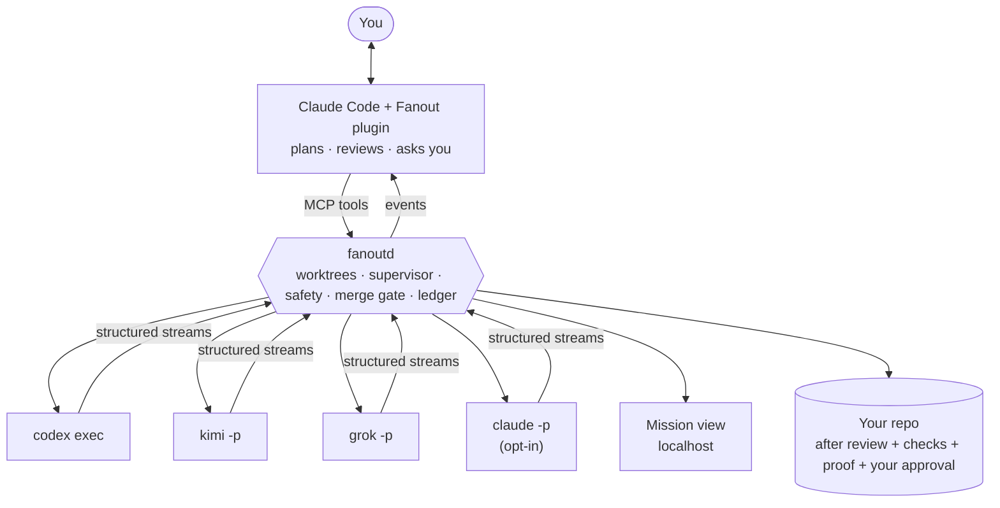

<div align="center">

# Fanout

**Claude Code leads. Your other agents build.**

Turn the AI coding subscriptions you already pay for into one crew: a lead that plans and reviews,
teammates that work in parallel, and nothing merged until it is proven.

[](https://github.com/elberacasa/fanout/actions/workflows/ci.yml)
[](docs/STATUS.md)
[](package.json)
[](tsconfig.base.json)
[](LICENSE)
[](CONTRIBUTING.md)

[What it is](#what-it-is) · [How it works](#how-it-works) · [Quickstart](#quickstart) ·
[Status](#status) · [Safety](#the-promises) · [Docs](#docs) · [Contributing](CONTRIBUTING.md)

</div>

---

## What it is

You already pay for several coding agents: Claude Code, Codex, Kimi, Grok, Cursor. They sit in separate terminals,
run one at a time, and their quotas expire unused. Running them in parallel by hand means juggling branches,
copy-pasted prompts and diffs you never really reviewed.

Fanout is a **Claude Code plugin plus a local daemon**. You stay in the session you already use. Claude plans the
mission, fans the work out to the other CLIs on your machine — each in its own git worktree — watches them live,
reviews every diff, runs your real checks, proves the fixes, and asks you before anything merges.

> [!NOTE]
> **Pre-alpha.** The engine is real and tested: isolated runs, an append-only ledger, the review contract. The
> plugin, the mission view and the demo are being built in the open — see [Status](#status) and
> [docs/STATUS.md](docs/STATUS.md). Nothing is published to npm yet.

## How it works



1. **Ask.** `/fanout add CSV export and fix the flaky date test`
2. **Plan.** Claude reads the repo and proposes lines: who builds what, in which files, with which agent.
3. **Safety report.** Overlapping write scopes, secrets, sandbox and network flags, and the exact commands that
   will run — green before anything launches.
4. **Watch.** Every agent runs in its own worktree. Phases, tool calls, files, tests and a growing diff, live.
5. **Merge gate.** Review, your project's checks, a bug fix proven to fail on the old code, then your approval.

<!-- The 30-second demo lands with the mission view (P0 · 10). See docs/media/README.md. -->

## Quickstart

Nothing is published yet, so this is the contributor path:

```sh
git clone https://github.com/elberacasa/fanout.git && cd fanout
corepack enable && pnpm install
git config core.hooksPath .githooks
npm run check      # typecheck + lint + 311 tests
```

Requires **Node 22.18+** (the ledger uses Node's built-in SQLite; TypeScript runs without a build step).

When the CLI lands you will be able to try the whole flow offline, with no accounts, using the simulated agent:

```sh
fanout demo        # P0 · 10
```

## Why it is different

| | |
|---|---|
| **Your subscriptions, not API keys** | Each vendor's own CLI in its official non-interactive mode. We never read, store or proxy a credential |
| **It lives where you work** | Plan, review and approve inside Claude Code. No second app to learn |
| **Agents review each other** | Claude reviews Codex's diff; different models catch different mistakes |
| **A merge gate with proof** | Worktree isolation, your checks, a failing-first test for every bug fix, your approval |
| **One append-only ledger** | Every run is explainable and replayable; the database itself refuses to rewrite history |
| **Local-first** | Code, prompts and the ledger stay on your machine. The mission view is served on localhost only |

## Status

P0 · **Claude leads, the crew builds** — 311 tests, green on macOS and Linux, Node 22 and 24.

| Milestone | State |
|---|---|
| 1 · Foundations — schemas, ledger, projections | ✅ done |
| 2 · Fake seat + supervisor | ✅ done |
| 3 · Workspace + safety report | ✅ done |
| 4 · Real seats — Codex, Grok, Claude (opt-in) built from recorded runs; Kimi waiting on its own quota | ✅ done |
| 5 · Daemon API + CLI | 🔨 next |
| 6 · The Claude Code plugin | ⬜ |
| 7 · Merge gate | ⬜ |
| 8 · Mission view | ⬜ |
| 9 · Routing when a seat hits its limit | ⬜ |
| 10 · Offline demo, video, README refresh | ⬜ |

Full plan in [docs/ROADMAP.md](docs/ROADMAP.md); what changed and who built it in
[docs/BUILD_LOG.md](docs/BUILD_LOG.md).

## The promises

These are not traded for speed, ever:

- **Subscriptions through official headless modes only.** No credential reuse, no private endpoints, no working
  around limits.
- **Isolation.** Each editing run gets its own worktree; auditors get a read-only copy. Agents never commit, never
  touch your branch, and never receive secrets or ignored files.
- **Nothing merges unreviewed.** Review, checks, proof, your approval.
- **Local-first and private.** No telemetry unless you turn it on.
- **Honest interfaces.** Estimated numbers say "estimated"; unknown states say so; a failed load never looks like
  "nothing to do".

Security policy and known limits: [SECURITY.md](SECURITY.md).

## Built by a crew, in public

Fanout is built the way it wants you to build. **Claude Code leads** (plans, writes the prompts, reviews every diff,
runs the checks, merges) and **Codex agents are teammates** (parallel builders and auditors, each in its own
worktree) through the [`codex-fanout`](https://github.com/elberacasa/codex-fanout) skill in `.claude/skills/`.

Every contribution is credited in its commit trailer and in the [build log](docs/BUILD_LOG.md): who built it, with
which model and prompt, what review changed, and what could not be verified. One example from milestone 2: an
adversarial audit by an agent found six real bugs in the lead's own code, including a path-matching flaw that let a
run escape its declared scope. Each was fixed with a test that failed on the old code first.

## Docs

| Document | What it holds |
|---|---|
| [STATUS](docs/STATUS.md) | **Resume here:** where the project is and what is next |
| [VISION](docs/VISION.md) | Why this exists, who it is for, the field, how it wins |
| [PRODUCT](docs/PRODUCT.md) | Concepts, the flow, the mission view, quota-aware routing |
| [ARCHITECTURE](docs/ARCHITECTURE.md) | Plugin, daemon, event schema, MCP tools, safety, known contract gaps |
| [ADAPTERS](docs/ADAPTERS.md) | The seat adapter contract and the verified CLI tracker |
| [ROADMAP](docs/ROADMAP.md) | Phases with a definition of done |
| [PLAYBOOK](docs/PLAYBOOK.md) | How the lead and the agent teammates build together |
| [DECISIONS](docs/DECISIONS.md) | Architecture decision records |
| [COMMITS](docs/COMMITS.md) | The commit standard, enforced by a hook and by CI |
| [BUILD LOG](docs/BUILD_LOG.md) | The public record of the crew at work |

## Contributing

Adapters for new agent CLIs, bug fixes with failing-first tests, and docs are all welcome. Start with
[CONTRIBUTING.md](CONTRIBUTING.md) and [docs/COMMITS.md](docs/COMMITS.md). Be decent:
[code of conduct](CODE_OF_CONDUCT.md).

## License

[MIT](LICENSE) © elberacasa
