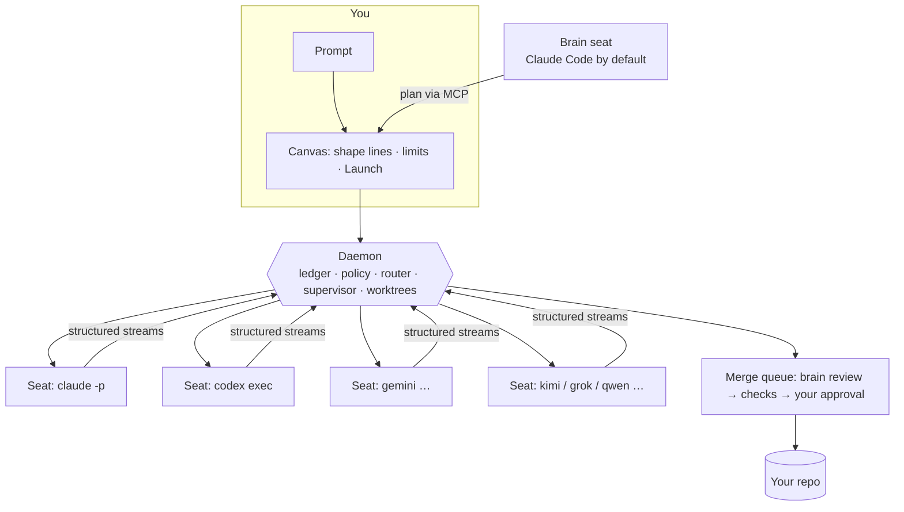

# Fanout

> **Your AI subscriptions, one crew.** *(working name, final name chosen in session 1; see [docs/DECISIONS.md](docs/DECISIONS.md))*

**Status: pre-alpha.** This repository holds the foundation (vision, product, architecture, roadmap and the way we
build). The first code is P0 milestone 1 in [docs/ROADMAP.md](docs/ROADMAP.md).

---

## What it is

A local app that turns the AI coding agents you **already pay for** into one team: Claude Code, OpenAI Codex, Gemini,
Kimi, Grok, Qwen, and more. It uses **your subscriptions, through each CLI's official headless mode. No API keys.**

1. **It finds your crew.** It scans your machine for installed, signed-in agent CLIs. Each one becomes a *seat*:
   Claude Max, ChatGPT Pro, Gemini, each with a live quota meter.
2. **A brain plans first.** A brain of your choice (Claude Code by default) reads the repo and proposes a mission: a
   graph of tasks, their file scopes, dependencies, and which seat, model and effort suits each.
3. **You shape the fan-out on a canvas.** Add a line, pick the seat, model and effort, drop a prompt card on it,
   connect dependencies. A safety report must turn green before **Launch**.
4. **You watch the crew work.** Every agent runs in its own git worktree. You see its tool calls, files, tests, quota
   and a live diff.
5. **Nothing merges unreviewed.** Diffs arrive in a merge queue: the brain reviews, your checks run, you approve.
   Rework or drop anything, and replay every mission afterwards.

When one subscription runs low, work moves to another: *"Claude is resting until 4:10, sending the tests to Codex."*

## Why it's different

- **Subscriptions, not keys.** The CLIs you use stay the only thing that holds your credentials. We never read,
  store or proxy them.
- **The control layer.** Per-agent limits (time, steps, quota, files, commands, network), quota-aware routing across
  your subscriptions, approval gates, kill, pause and steer.
- **Verification is built in.** Worktree isolation, agents never commit, a brain review, proof that bug fixes fail on
  the old code, and your real checks run before any merge.
- **One event ledger.** The canvas, the terminal UI, the brain and replays all read the same append-only stream.
- **Local-first.** Your code and your prompts stay on your machine. No telemetry by default.

## How it works

## Built by a crew

This project is built the way it wants others to build: **Claude Code leads** (plans, reviews, merges) and **Codex
agents are teammates** (parallel builders and auditors, each in its own worktree) through the
[`codex-fanout`](https://github.com/elberacasa/codex-fanout) skill, which is in `.claude/skills/`. Every
contribution is credited in the commit trailers and in the public [build log](docs/BUILD_LOG.md): who built what,
with which prompt, and what review changed.

## Repository map

| File | What it holds |
|---|---|
| [AGENTS.md](AGENTS.md) | The rules for every agent working here (Claude reads it through CLAUDE.md) |
| [docs/STATUS.md](docs/STATUS.md) | **Resume here:** where we are and the next task |
| [docs/VISION.md](docs/VISION.md) | Why this exists, who it is for, how it wins |
| [docs/PRODUCT.md](docs/PRODUCT.md) | Concepts, the flow, the canvas, seats, safety, the merge queue |
| [docs/ARCHITECTURE.md](docs/ARCHITECTURE.md) | Daemon, event schema, adapters, MCP tools, UI, stack |
| [docs/ADAPTERS.md](docs/ADAPTERS.md) | The seat adapter contract and the CLI integration tracker |
| [docs/ROADMAP.md](docs/ROADMAP.md) | Phases with a definition of done |
| [docs/PLAYBOOK.md](docs/PLAYBOOK.md) | How Claude and Codex build this together |
| [docs/DECISIONS.md](docs/DECISIONS.md) | Architecture decision records |
| [docs/BUILD_LOG.md](docs/BUILD_LOG.md) | The public record of the crew at work |
| [KICKOFF.md](KICKOFF.md) | The first prompt for session 1 |

## License

[MIT](LICENSE) © elberacasa
