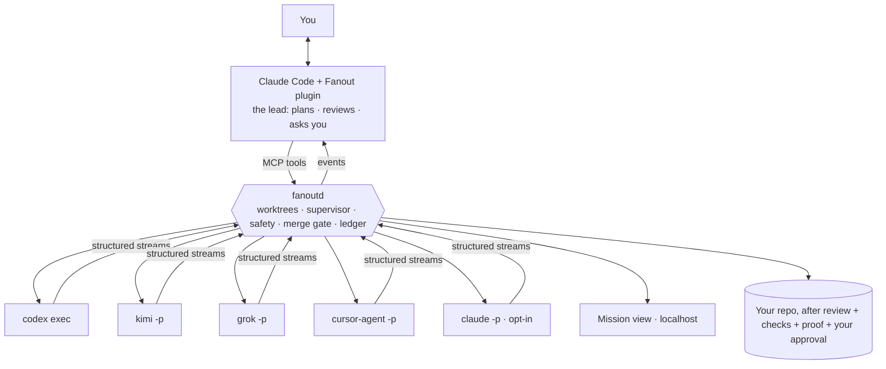

# Fanout

> **Claude Code leads. Your other agents build.** *(working name; see [docs/DECISIONS.md](docs/DECISIONS.md) 0007)*

**Status: pre-alpha.** This repository holds the foundation (vision, product, architecture, roadmap and the way we
build). The first code is P0 milestone 1 in [docs/ROADMAP.md](docs/ROADMAP.md).

---

## What it is

A Claude Code plugin and a local daemon that turn the agent CLIs you **already pay for** into one crew, with Claude
Code as the lead: Codex, Kimi, Grok, Cursor, and Claude itself when you opt in. It uses **your subscriptions, through
each CLI's official non-interactive mode. No API keys.**

1. **Ask in Claude Code.** `/fanout add CSV export and fix the flaky date test`.
2. **Claude plans.** It reads the repo and proposes lines: who builds what, in which files, with which agent and
   effort. A safety report must turn green before launch.
3. **Your crew builds in parallel.** Every agent runs in its own git worktree. A local mission view shows each one
   live: phase, tool calls, files, tests, a growing diff.
4. **Nothing merges unreviewed.** Claude reviews every diff, your real checks run, bug fixes are proven to fail on the
   old code, and you approve the merge.

When one subscription runs low, work moves to another, with the reason shown.

## Why it's different

- **It lives where you already work.** Plan, review and approve in your Claude Code session. No new app to learn.
- **Cross-vendor review.** Claude reviews Codex's work; different models catch different mistakes.
- **A merge gate with proof.** Worktree isolation, agents never commit, your checks, proof of fixes, your approval.
- **Subscriptions, not keys.** The CLIs stay the only thing that holds your credentials. We never read, store or proxy
  them.
- **Local-first.** Your code, prompts and the event ledger stay on your machine. The mission view is served on
  localhost only. No telemetry by default.

## How it works

## Built by a crew

This project is built the way it wants others to build: **Claude Code leads** (plans, reviews, merges) and **Codex
agents are teammates** (parallel builders and auditors, each in its own worktree) through the
[`codex-fanout`](https://github.com/elberacasa/codex-fanout) skill, which is in `.claude/skills/`. Every
contribution is credited in the commit trailers and in the public [build log](docs/BUILD_LOG.md): who built what,
with which prompt, and what review changed.

## Repository map

| File | What it holds |
|---|---|
| [AGENTS.md](AGENTS.md) | The rules for every agent working here (Claude reads it through CLAUDE.md) |
| [docs/STATUS.md](docs/STATUS.md) | **Resume here:** where we are and the next task |
| [docs/VISION.md](docs/VISION.md) | Why this exists, who it is for, the field, how it wins |
| [docs/PRODUCT.md](docs/PRODUCT.md) | Concepts, the flow inside Claude Code, the mission view, the 30-second video |
| [docs/ARCHITECTURE.md](docs/ARCHITECTURE.md) | Plugin, daemon, event schema, adapters, MCP tools, safety, stack |
| [docs/ADAPTERS.md](docs/ADAPTERS.md) | The seat adapter contract and the verified CLI tracker |
| [docs/ROADMAP.md](docs/ROADMAP.md) | Phases with a definition of done |
| [docs/PLAYBOOK.md](docs/PLAYBOOK.md) | How Claude and Codex build this together |
| [docs/DECISIONS.md](docs/DECISIONS.md) | Architecture decision records |
| [docs/BUILD_LOG.md](docs/BUILD_LOG.md) | The public record of the crew at work |

## License

[MIT](LICENSE) © elberacasa
